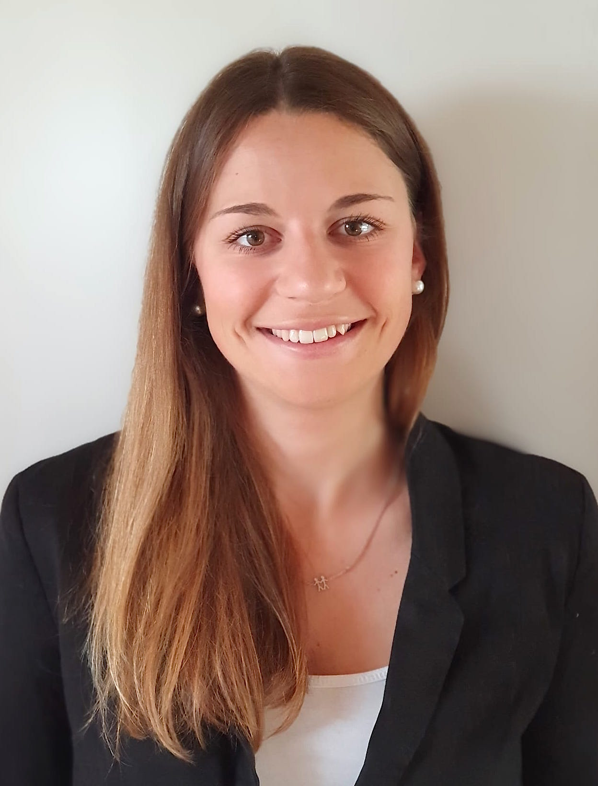
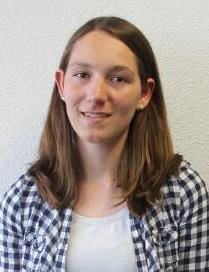

```{=html}
<style> 
  distill-site-header {
    background-color: red;
  }
</style>
```

### Dr. Basil Preisig

::: floatting
```{r out.width='30%', out.extra='style="float:left; padding:10px"', echo=FALSE}

```

I obtained my PhD in Neuroscience at the University of Bern in 2016. Afterwards, I did a postdoctoral fellowship at the Donders Institute for Cognitive Neuroimaging and the Max Planck Institute for Psycholinguistics in Nijmegen before I joined the Neurolinguistcs lab at the University of Zurich in 2019. In autumn 2021, I was awarded the prestigious Ambizione career grant by the Swiss National Science Foundation to start my own research group at the Department of Comparative Language Science.

<br>

[Website](https://www.comparativelinguistics.uzh.ch/en/staff/preisig.html)

[Contact](mailto::basil%5Bdot%5Dpreisig%5Bat%5Duzh%5Bdot%5Dch)
:::

### Anouk Glättli

::: floatting
```{r out.width='30%', out.extra='style="float:left; padding:10px"', echo=FALSE}

```

Anouk Glättli completed her Bachelor's degree in Psychology at the University of Bern. After two clinical internships in neuropsychology, wrote her MSc Psychology thesis in the lab, and completed her Master's degree at the University of Zurich, focusing on development, neuroscience, and cognition. She subsequently worked as a research assistant, following-up on her master's project, focusing on the role of the articulatory motor cortex and the use of non-invasive brain stimulation in speech perception under challenging listening conditions. Working on various research projects during her studies sparked her interest in cognitive neuroscience, a field she is eager to pursue after graduation.
:::

### Daniela Benz

::: floatting
```{r out.width='30%', out.extra='style="float:left; padding:10px"', echo=FALSE}

```

Daniela Benz wrote her MSc Psychology thesis on the role of the articulatory motor cortex in degraded speech perception and perceptual learning. Her project uses non-invasive electrical brain stimulation. During her Bachelor's degree in Psychology at the University of Zurich, she attended several courses and seminars on neurosciences, and wrote her Bachelor's thesis on the topic of cognitive advantages in simultaneous interpreters. Her research interest grew after completing an internship at the Department of Child and Adolescent Psychiatry and Psychotherapy, where she assisted in a research project on developmental dyslexia. Daniela has a strong interest in development, neuroscience, and cognition.
:::
