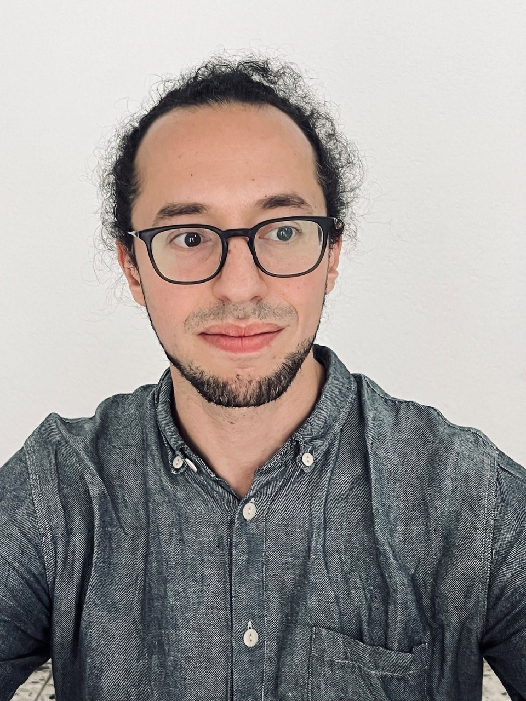
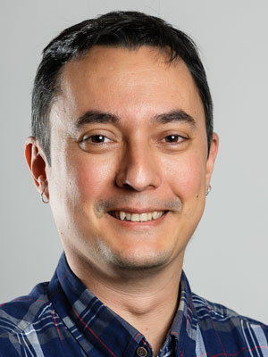

### Prof. Dr. Alexis Hervais-Adelman (Group leader)
 

[Scholar profile](https://scholar.google.com/citations?user=CSXgCEoAAAAJ&hl=en&oi=ao)
[ORCID](https://orcid.org/0000-0002-5232-626X)

Alexis Hervais-Adelman is head of the Neurolinguistics Division at the Psychology Institute of the University of Zurich. His research uses several approaches to elucidate the brain networks of language, and interventions that might serve to train and improve them. His team deploys multiple neuroimaging and behavioural methods methods to investigate the brain networks of extreme language - be it the perception of acoustically challenging speech, or the challenges posed by multilingualism.

He began his academic career at the University of Cambridge, where he obtained his doctoral degree in cognitive neuroscience in 2008, for his thesis entitled "The perceptual learning of degraded speech". Subsequently he worked at the Centre for the Neural Basis of Hearing, Cambridge University Department of Physiology, investigating the representation of speech sounds in human auditory cortex. In 2009 he moved to the University of Geneva where he held positions in the Fundamental Neuroscience Department and the Department of Interpreting. There, he worked extensively on the neuroscience of simultaneous interpreting in order to reveal the brain networks that allow interpreters to carry out their highly challenging multilingual work and has examined the consequences of expertise in simultaneous interpretation for the brain. Subsequently, he became a member of research staff at the Neurobiology of Language group at the Max Planck Institute for Psycholinguistics, Nijmegen. There he became involved in several projects investigating diverse aspects of the human language faculty. 

 

### Dr Gorka Fraga-Gonzalez

[Scholar profile](https://scholar.google.com/citations?user=pSAXHtYAAAAJ&hl=en&oi=ao) 

 

Gorka Fraga González is a postdoctoral researcher with an interest in understanding brain function for different aspects of learning and development. Gorka received his PhD in 2016 at the University of Amsterdam (Developmental Psychology). His doctoral thesis “Fixing fluency: neurocognitive assessment of a dysfluent reading intervention” used electroencephalography (EEG) and a longitudinal design to study brain responses to words in children with and without dyslexia. He continued as a postdoc in the University of Amsterdam examining electrophysiological responses and EEG networks associated with feedback-based learning of novel symbol-speech sound associations. In 2018 he moved to the Department of Child and Adolescent Psychiatry and Psychotherapy, at the University of Zurich. He worked on several developmental EEG studies examining letter and number processing through kindergarten and elementary school.  From 2020 to 2022 he led the project “Grapholemo: Grapheme-phoneme learning modelling”, where he used functional magnetic resonance imaging (fMRI) and a computational model (reinforcement learning drift diffusion) to delineate the brain areas involved in symbol-speech sound learning.

 

