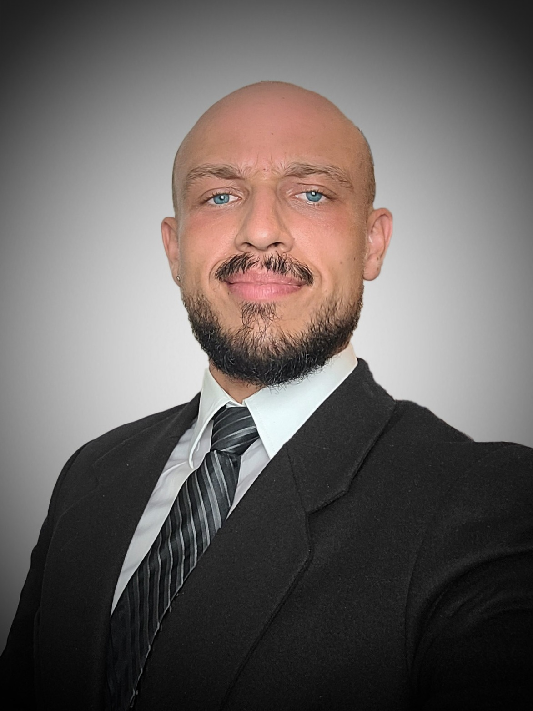

```{=html}
<style> 
  distill-site-header {
    background-color: red;
  }
</style>
```
### Prof. Dr. Alexis Hervais-Adelman (Group leader)

::: floatting
```{r out.width='30%', out.extra='style="float:left; padding:10px"',echo=FALSE, background-color: BalloonBlue}
knitr::include_graphics("images/Alexis.jpg")

```

Alexis Hervais-Adelman is head of the Neurolinguistics Division at the Psychology Institute of the University of Zurich. His research uses several approaches to elucidate the brain networks of language, and interventions that might serve to train and improve them. His team deploys multiple neuroimaging and behavioural methods methods to investigate the brain networks of extreme language - be it the perception of acoustically challenging speech, or the challenges posed by multilingualism.

He began his academic career at the University of Cambridge, where he obtained his doctoral degree in cognitive neuroscience in 2008, for his thesis entitled "The perceptual learning of degraded speech". Subsequently he worked at the Centre for the Neural Basis of Hearing, Cambridge University Department of Physiology, investigating the representation of speech sounds in human auditory cortex. In 2009 he moved to the University of Geneva where he held positions in the Fundamental Neuroscience Department and the Department of Interpreting. There, he worked extensively on the neuroscience of simultaneous interpreting in order to reveal the brain networks that allow interpreters to carry out their highly challenging multilingual work and has examined the consequences of expertise in simultaneous interpretation for the brain. Subsequently, he became a member of research staff at the Neurobiology of Language group at the Max Planck Institute for Psycholinguistics, Nijmegen. There he became involved in several projects investigating diverse aspects of the human language faculty.

[Scholar profile](https://scholar.google.com/citations?user=CSXgCEoAAAAJ&hl=en&oi=ao)

[ORCID](https://orcid.org/0000-0002-5232-626X)

[Contact](mailto::alexis%5Bdot%5Dhervais-adelman%5Bat%5Dpsychologie%5Bdot%5Duzh%5Bdot%5Dch)
:::

<br>

### Dr. Gorka Fraga-González

::: floatting
```{r out.width='30%', out.extra='style="float:left; padding:10px"', echo=FALSE}
knitr::include_graphics("images/Gorka1.jpg")
```

Gorka Fraga González is a postdoctoral researcher with an interest in understanding brain function for different aspects of learning and development. Gorka received his PhD in 2016 at the University of Amsterdam (Developmental Psychology). His doctoral thesis "Fixing fluency: neurocognitive assessment of a dysfluent reading intervention" used electroencephalography (EEG) and a longitudinal design to study brain responses to words in children with and without dyslexia. He continued as a postdoc in the University of Amsterdam examining electrophysiological responses and EEG networks associated with feedback-based learning of novel symbol-speech sound associations. In 2018 he moved to the Department of Child and Adolescent Psychiatry and Psychotherapy, at the University of Zurich. He worked on several developmental EEG studies examining letter and number processing through kindergarten and elementary school. From 2020 to 2022 he led the project "Grapholemo: Grapheme-phoneme learning modelling", where he used functional magnetic resonance imaging (fMRI) and a computational model (reinforcement learning drift diffusion) to delineate the brain areas involved in symbol-speech sound learning.

[Scholar profile](https://scholar.google.com/citations?user=pSAXHtYAAAAJ&hl=en&oi=ao)

[ORCID](https://orcid.org/0000-0002-1857-8607)

[Contact](mailto::gorka%5Bdot%5Dfragagonzalez%5Bat%5Duzh%5Bdot%5Dch)
:::

<br>

### Huw Swanborough

::: floatting
```{r out.width='30%', out.extra='style="float:left; padding:10px"', echo=FALSE}
knitr::include_graphics("images/huw.jpg")
```

My research interests lie within auditory cognitive-neuroscience, focusing on affective processing and auditory streaming, but also with an interest towards multi-modal processing. My work at University of Zurich is concerned with the perception of affective voices in noisy conditions, and the underlying neural correlates responsible for accurate perception and categorization.

[Scholar profile](https://scholar.google.com/citations?user=Xem3MPQAAAAJ&hl=en&oi=ao)

[ORCID](https://orcid.org/0000-0002-5530-0583)
:::

<br>

### Enrico Varano

::: floatting
```{r out.width='30%', out.extra='style="float:left; padding:10px"', echo=FALSE}
knitr::include_graphics("images/enrico.jpg")
```

Enrico Varano is transitioning to a postdoctoral position in the Neurolinguistics Division of the Psychology Institute, University of Zurich, where he is investigating language processes using transcranial random noise stimulation.

Enrico's joined Imperial College London, Department of Bioengineering, in 2018 to pursue a PhD in Sensory Neuroscience. Employing electroencephalography (EEG) and a variety of visual signals, he focused on the brain's ability to integrate the audio and visual components of natural speech to overcome comprehension difficulties in noisy environments, and the neural mechanisms that underpin this skill. He also investigated how multimodal integration processes change with ageing and published a corpus of speech media specifically designed to enable reproducible and ecologically valid EEG studies in audiovisual speech comprehension and integration. By employing AI-generated talking head videos to improve speech-in-noise comprehension, he showed that findings in the field may be immediately applicable in the development of multimodal hearing prostheses. At Imperial College London, Enrico also worked with transcranial alternating current stimulation to investigate the neural processing of concurrent speakers.

Fun fact: Enrico's research career began at the University of Bristol, from which he received his Bachelor's degree in engineering in 2018, where he worked on nano-reinforced polymer composites.

[Scholar profile](https://scholar.google.co.uk/citations?user=OgXjiZAAAAAJ&hl=en)

[ORCID](https://orcid.org/0000-0002-0407-7190)
:::

<br>

### Alejandra Hüsser

::: floatting
```{r out.width='40%', out.extra='style="float:left; padding:10px"', echo=FALSE}
knitr::include_graphics("images/Alejandra1.png")
```

Alejandra Hüsser is transitioning to a postdoctoral position in the Neurolinguistics lab. Her research interests are neurodevelopment, neuropathologies, functional brain networks and brain plasticity in children and adolescents. She has previously investigated cerebral language networks in paediatric patients with epilepsy in the LIONlab at the Université de Montréal. She conducted functional neuroimaging with electroencephalography (EEG) and near-infrared spectroscopy (NIRS) and further has experience in neuropsychological assessments of children and adults both in clinical and scientific settings.

As a post-doctoral fellow Alejandra will focus on the early development of cerebral networksinvolved in speech production and specifically look into prenatal and neonatal brain dynamics of different key brain regions of language networks.

Her work aims to increase the understanding of the developmental trajectory of cerebral language processing, to enlighten how characteristics of the foetus' and infant's brain relates to language abilities and to better identify the alterations related to neuropathologies.

[Scholar profile](https://scholar.google.com/citations?hl=en&user=Eiq8Q8wAAAAJ&view_op=list_works&sortby=pubdate%20%E2%80%98%20Completing%20her%20PhD%20at%20the%20University%20de%20Montr%C3%A9al%20in%20Cognitive%20Neuroscience%20and%20Neuropsychology)

[ORCID](https://orcid.org/0000-0003-4608-8514)
:::

<br>

### Dr. Basil Preisig

::: floatting
```{r out.width='30%', out.extra='style="float:left; padding:10px"', echo=FALSE}
knitr::include_graphics("images/Basil.jpg")
```

I obtained my PhD in Neuroscience at the University of Bern in 2016. Afterwards, I did a postdoctoral fellowship at the Donders Institute for Cognitive Neuroimaging and the Max Planck Institute for Psycholinguistics in Nijmegen before I joined the Neurolinguistcs lab at the University of Zurich in 2019. In autumn 2021, I was awarded the prestigious Ambizione career grant by the Swiss National Science Foundation to start my own research group at the Department of Comparative Language Science.

<br>

[Website](https://www.comparativelinguistics.uzh.ch/en/staff/preisig.html)

[Contact](mailto::basil%5Bdot%5Dpreisig%5Bat%5Duzh%5Bdot%5Dch)
:::

<br>

### Lea Bächlin

::: floatting
```{r out.width='30%', out.extra='style="float:left; padding:10px"', echo=FALSE}
knitr::include_graphics("images/Lea.jpg")
```

Lea Bächlin is a master's student in psychology at the University of Zurich. She is interested in mechanisms of perception and sleep as well as in neuroscientific methods in general. She received her bachelor's degree from the University of Berne with a focus on neuroscience. During her undergraduate studies, she worked as a research assistant on a study using electroencephalography (EEG) to investigate auditory processing during sleep. As a research assistant in the Division of Neurolinguistics, she is analyzing functional magnetic resonance (fMRI) data collected at the Donders Institute for Brain, Cognition and Behaviour, Nijmegen, The Netherlands. This project combines transcranial direct-current stimulation (tDCS) and fMRI to examine the role of motor cortices in speech in noise perception.
:::

### Zachary William Hopton

::: floatting
```{r out.width='30%', out.extra='style="float:left; padding:10px"', echo=FALSE}
knitr::include_graphics("images/Zachary.jpeg")
```

Zachary Hopton is a master's student at the University of Zürich studying computational linguistics and evolutionary language science.
He received his bachelor's degree from the Georgia Institute of Technology, where he spent two years researching the neural activity underpinning
episodic memory changes associated with aging and depression. He is currently working with the lab as a research assistant analyzing fMRI data to study Broca's area and its right-hemisphere homologue. Zachary is especially excited to explore how concepts from cognitive neuroscience and natural language processing can inform each other.
:::

### Remo Gruber

::: floatting
```{r out.width='30%', out.extra='style="float:left; padding:10px"', echo=FALSE}
knitr::include_graphics("images/Remo.jpg")
```

Remo Gruber is currently working on his Master's thesis at the Division of Neurolinguistics at the University of Zürich where he is examining the nature of infant cries as a communicative signal, and on how they may have evolved over time elicit responses from parents and caregivers. Following his strong interest in neurolinguistics, he has written his Bachelor's thesis at the Division of Neurolinguistics on the subject of arithmetic skills and their relation to words for numbers.

His secondary interest lies within clinical psychology. Currently, Remo combines his Master's thesis at Neuroliguistics with an internship at the University Hospital Zürich, conducting research on the early detection of psychosis with a focus on resilience factors.

:::
### Samuel Alexander Müller

::: floatting
```{r out.width='30%', out.extra='style="float:left; padding:10px"', echo=FALSE}

```

Samuel Alexander Müller is working as a research assistant while finishing up his Master's degree in Cognitive Neuroscience at the University of Fribourg. Both his Bachelor and his Master Thesis use EEG, ECG, and a signal discrimination task to explore the connection between cardiac signals and the brain, under the kind supervision of Dr. Juliane Britz. In his time in Fribourg, he was able to give mentorship classes to first-year bachelor students in several subjects. He enjoys working with Python to process and analyse EEG data and plans on pursuing an academic career.

:::

### Sibylle Meier

::: floatting
```{r out.width='30%', out.extra='style="float:left; padding:10px"', echo=FALSE}
knitr::include_graphics("images/Sibylle.jpg")
```

Sibylle Meier is currently pursuing a Master of Science in Psychology at the University of Zurich. During her studies, she focused on neuropsychology in addition to clinical psychology. Among other things, she dealt with a wide variety of methods to study structural and/or functional changes in the brain. During her six-month internship at the Lengg Clinic for inpatient neurorehabilitation, she also worked daily with patients whose cognitive functions were impaired by accident or disease. She would now like to deepen her theoretical knowledge as well as her practical experience in the field of neuropsychology through her master thesis by participating in  the research on the topic "Real-Time Neurofeedback for Enhancing Speech Comprehension in Noise". She is particularly interested in the used research methods such as electroencephalography (EEG) and the resulting possibilities for statistical data analysis. 

:::

### Besim Prenaj

::: floatting
```{r out.width='30%', out.extra='style="float:left; padding:10px"', echo=FALSE}

```

As part of his Master's program at the University of Zurich, Besim Prenaj explores language development in his thesis, focusing on speech production. He investigates the functional brain areas of infants using rs-fMRI data collected by the dHCP. He is interested in how different brain areas interact, their developmental interrelationships, and the roles they play in both individual human development and in the evolutionary history of humans. Besim has completed a clinical internship, but over his academic journey, his passion for neuroscience has intensified. He is interested in understanding how the brain produces language, and moreover, how language evolved to shape our species, and how it continues to shape our brains.

:::

### Diana Bürkler-Torosjan

::: floatting
```{r out.width='30%', out.extra='style="float:left; padding:10px"', echo=FALSE}
knitr::include_graphics("images/blank.jpg")
```

Diana Bürkler-Torosjan is a part-time research assistant in this lab. She is currently conducting a follow-up examination based on her master’s thesis, focusing on the role of neuroanatomy in speech perception during noise. Diana completed her Master’s degree in Psychology at the University of Zurich and is currently working in a neurological rehabilitation center. Her interests encompass clinical neuropsychology and neuroscience

:::

### Anouk Glättli

::: floatting
```{r out.width='30%', out.extra='style="float:left; padding:10px"', echo=FALSE}
knitr::include_graphics("images/Anouk.jpg")
```

Anouk Glättli is working as a research assistant in this lab. Her current research, a follow-up experiment on her master project, focuses on the role of the articulatory motor cortex and the use of non-invasive brain stimulation in speech perception under challenging listening conditions. Anouk completed her Bachelor's degree in Psychology at the University of Berne. After doing two clinical internships in neuropsychology, she's currently completing her Master's degree at the University of Zurich, focusing on development, neuroscience, and cognition. Working on various research projects during her studies sparked her interest in cognitive neuroscience, a field she is eager to pursue after graduation.
:::

### Daniela Benz

::: floatting
```{r out.width='30%', out.extra='style="float:left; padding:10px"', echo=FALSE}
knitr::include_graphics("images/Daniela.jpg")
```

Daniela Benz is a Master student currently writing her thesis on the role of the articulatory motor cortex in degraded speech perception and perceptual learning. Her project uses non-invasive electrical brain stimulation. During her Bachelor's degree in Psychology at the University of Zurich, she attended several courses and seminars on neurosciences, and wrote her Bachelor's thesis on the topic of cognitive advantages in simultaneous interpreters. Her research interest grew after completing an internship at the Department of Child and Adolescent Psychiatry and Psychotherapy, where she assisted in a research project on developmental dyslexia. Daniela has a strong interest in development, neuroscience, and cognition.
:::
