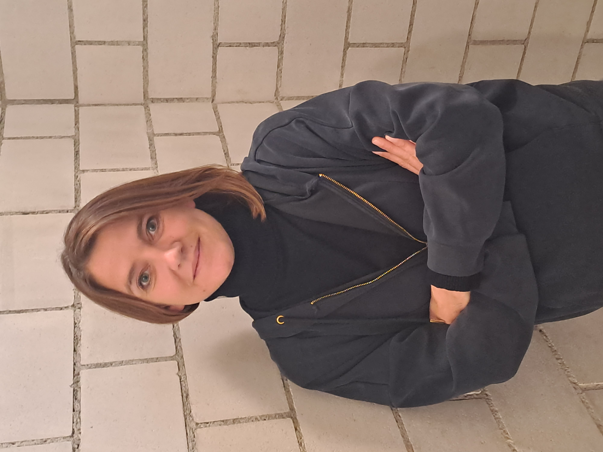

<!-- ```{=html} -->
<!-- <style>  -->
<!--   distill-site-header { -->
<!--     background-color: red; -->
<!--   } -->
<!-- </style> -->
<!-- ``` -->


```{=html}
<style> 
  distill-site-header {
    background-color: red;
  }
  .container {
    display: flex;
    flex-direction: row;
    justify-content: space-between;
  }
  .column {
    width: 45%; /* Adjust as needed */
  }
</style>
```
## Group Leader
<br>

### Prof. Dr. Alexis Hervais-Adelman
:::: {style="display: flex;"}
::: floatting
```{r out.width='30%', out.extra='style="float:left; padding:10px"',echo=FALSE, background-color: BalloonBlue}


```

Alexis Hervais-Adelman is head of the Neurolinguistics Team at the Psychology Department of the University of Zurich where he worked full-time from 2018 to 2023. He is now Assistant Professor and head of the Dynamics of Brain and Language Lab at the University of Geneva and continues to work at the University of Zurich.
His research uses several approaches to elucidate the brain networks of language, and interventions that might serve to train and improve them. His team deploys multiple neuroimaging and behavioural methods methods to investigate the brain networks of extreme language - be it the perception of acoustically challenging speech, or the challenges posed by multilingualism.

He began his academic career at the University of Cambridge, where he obtained his doctoral degree in cognitive neuroscience in 2008, for his thesis entitled "The perceptual learning of degraded speech". Subsequently he worked at the Centre for the Neural Basis of Hearing, Cambridge University Department of Physiology, investigating the representation of speech sounds in human auditory cortex. In 2009 he moved to the University of Geneva where he held positions in the Fundamental Neuroscience Department and the Department of Interpreting. There, he worked extensively on the neuroscience of simultaneous interpreting in order to reveal the brain networks that allow interpreters to carry out their highly challenging multilingual work and has examined the consequences of expertise in simultaneous interpretation for the brain. Subsequently, he became a member of research staff at the Neurobiology of Language group at the Max Planck Institute for Psycholinguistics, Nijmegen. There he became involved in several projects investigating diverse aspects of the human language faculty.

[Scholar profile](https://scholar.google.com/citations?user=CSXgCEoAAAAJ&hl=en&oi=ao)

[ORCID](https://orcid.org/0000-0002-5232-626X)

[Contact](mailto::alexis%5Bdot%5Dhervais-adelman%5Bat%5Dpsychologie%5Bdot%5Duzh%5Bdot%5Dch)
:::
::::
<br>

## Post-Doctoral Researchers
<br>

### Dr. Gorka Fraga-González
:::: {style="display: flex;"}
::: floatting
```{r out.width='30%', out.extra='style="float:left; padding:10px"', echo=FALSE}
knitr::include_graphics("images/Gorka1.jpg")
```

Gorka Fraga González is a postdoctoral researcher with an interest in understanding brain function for different aspects of learning and development. Gorka received his PhD in 2016 at the University of Amsterdam (Developmental Psychology). His doctoral thesis "Fixing fluency: neurocognitive assessment of a dysfluent reading intervention" used electroencephalography (EEG) and a longitudinal design to study brain responses to words in children with and without dyslexia. He continued as a postdoc in the University of Amsterdam examining electrophysiological responses and EEG networks associated with feedback-based learning of novel symbol-speech sound associations. In 2018 he moved to the Department of Child and Adolescent Psychiatry and Psychotherapy, at the University of Zurich. He worked on several developmental EEG studies examining letter and number processing through kindergarten and elementary school. From 2020 to 2022 he led the project "Grapholemo: Grapheme-phoneme learning modelling", where he used functional magnetic resonance imaging (fMRI) and a computational model (reinforcement learning drift diffusion) to delineate the brain areas involved in symbol-speech sound learning.

[Scholar profile](https://scholar.google.com/citations?user=pSAXHtYAAAAJ&hl=en&oi=ao)

[ORCID](https://orcid.org/0000-0002-1857-8607)

[Contact](mailto::gorka%5Bdot%5Dfragagonzalez%5Bat%5Duzh%5Bdot%5Dch)
:::
::::
<br>

### Huw Swanborough
:::: {style="display: flex;"}
::: floatting
```{r out.width='30%', out.extra='style="float:left; padding:10px"', echo=FALSE}
knitr::include_graphics("images/huw.jpg")
```

My research interests lie within auditory cognitive-neuroscience, focusing on affective processing and auditory streaming, but also with an interest towards multi-modal processing. My work at University of Zurich is concerned with the perception of affective voices in noisy conditions, and the underlying neural correlates responsible for accurate perception and categorization.

[Scholar profile](https://scholar.google.com/citations?user=Xem3MPQAAAAJ&hl=en&oi=ao)

[ORCID](https://orcid.org/0000-0002-5530-0583)
:::
::::
<br>

### Dr. Enrico Varano
:::: {style="display: flex;"}
::: floatting
```{r out.width='30%', out.extra='style="float:left; padding:10px"', echo=FALSE}
knitr::include_graphics("images/enrico.jpg")
```

Enrico Varano is postdoctoral researcher in the Neurolinguistics Division of the Psychology Institute, University of Zurich, where he is investigating language processes using transcranial electrical stimulation.

Enrico’s received his PhD in Neurotechnology from Imperial College London, Department of Bioengineering, in 2023. Employing electroencephalography (EEG) and a variety of visual signals, he focused on the brain’s ability to integrate the audio and visual components of natural speech to overcome comprehension difficulties in noisy environments, and the neural mechanisms that underpin this skill. He also investigated how multimodal integration processes change with ageing and published a corpus of speech media specifically designed to enable reproducible and ecologically valid EEG studies in audiovisual speech comprehension and integration. By employing AI-generated talking head videos to improve speech-in-noise comprehension, he showed that findings in the field may be immediately applicable in the development of multimodal hearing prostheses. Enrico also worked with transcranial alternating current stimulation at Imperial College London, investigating the mechanisms employed by the brain when processing two concurrent speech streams.

Fun fact: Enrico’s research career began at the University of Bristol, from which he received his Bachelor’s degree in engineering in 2018, and where he published his first paper on nano-reinforced polymer composite materials.

[Scholar profile](https://scholar.google.co.uk/citations?user=OgXjiZAAAAAJ&hl=en)

[ORCID](https://orcid.org/0000-0002-0407-7190)
:::
::::
```{r}

```
<br>

### Dr. Alejandra M. Hüsser
:::: {style="display: flex;"}
::: floatting
```{r out.width='40%', out.extra='style="float:left; padding:10px"', echo=FALSE}
knitr::include_graphics("images/Alejandra1.png")
```

Alejandra M. Hüsser is a postdoctoral researcher in the Neurolinguistics lab. Her research interests are neurodevelopment, neuropathologies, functional brain networks and brain plasticity in children and adolescents.

In 2023, Alejandra was awarded a PhD in Cognitive Neuroscience from the Université de Montréal, Canada, for her research on cerebral language networks in paediatric patients with epilepsy. She applied functional neuroimaging with electroencephalography (EEG) and near-infrared spectroscopy (fNIRS) to assess cerebral language processing. Alejandra further has experience in neuropsychological assessments of children and adults both in clinical and scientific settings.</p>

As a post-doctoral fellow Alejandra focuses on the early development of cerebral networks involved in speech production and specifically looks into prenatal and neonatal brain dynamics of different key brain regions of language networks.

Her work aims to increase the understanding of the developmental trajectory of cerebral language processing, to enlighten how characteristics of the foetus’ and infant’s brain relates to language abilities and to better identify the alterations related to neuropathologies.

[Scholar profile](https://scholar.google.com/citations?hl=en&user=Eiq8Q8wAAAAJ&view_op=list_works&sortby=pubdate%20%E2%80%98%20Completing%20her%20PhD%20at%20the%20University%20de%20Montr%C3%A9al%20in%20Cognitive%20Neuroscience%20and%20Neuropsychology)

[ORCID](https://orcid.org/0000-0003-4608-8514)
:::
::::
<br>

### Dr. Natalia Bekemeier
:::: {style="display: flex;"}
::: floatting
```{r out.width='40%', out.extra='style="float:left; padding:10px"', echo=FALSE}
knitr::include_graphics("images/Bekemeier_N.jpg")
```

Natalia Bekemeier is a postdoctoral researcher at the Zurich Center for Linguistics (LiZZ) of the University of Zurich. Her research interests lie within the area of semantic and morphosyntactic processes underlying language comprehension. Natalia received her PhD in Linguistics in 2016 at the University of Konstanz, Germany. Her doctoral thesis “On the Representation and Processing of Phonological Stem Variants of Complex Words” employed electroencephalography (EEG) in a series of cross-linguistic studies ranging from single-word to sentence level presentation. Upon receiving her PhD, Natalia joined the CRC 991 at the Heinrich-Heine-University, Düsseldorf to investigate the structure of representations in language, cognition, and science, where she conducted several EEG, behavioral and eye-tracking studies focused on conceptual knowledge, mass-count distinction, and determiner/quantifier processing. In 2023, Natalia moved to the Zurich Center for Linguistics (LiZZ) of the University of Zurich to work on the SNF-funded project “Prototypes and Parts-of-Speech (ProPoS): A cross-linguistic, multi-methods approach to categorization with a focus on Adjectives”. In this project, she uses magnetoencephalography (MEG) to elucidate neurobiological correlates of the core parts of speech, such as noun, verb and adjective, and to investigate the contribution of part-of-speech information to the phrase structure building in three typologically different languages: English, Basque and Mandarin Chinese.
[Scholar](https://scholar.google.com/citations?user=Tk9Ln8EAAAAJ)

[Orcid](https://orcid.org/0000-0002-8516-6901)

[Loop](https://loop.frontiersin.org/people/927497/overview)

[LinkedIn](https://www.linkedin.com/in/natalia-bekemeier-3489b7102/)
:::
::::
<br>


### Zirui Huang
:::: {style="display: flex;"}
::: floatting
```{r out.width='40%', out.extra='style="float:left; padding:10px"', echo=FALSE}

```

Zirui Huang is a postdoctoral researcher at the Zurich Center for Linguistics in the University of Zurich. Prior to her current position, Zirui studied as a postgraduate student in the Faculty of linguistics, philology and phonetics, University of Oxford for her M.Phil and D.Phil since 2018. Her D.Phil projects mainly focus on phrase-level language comprehension with a special interest in classifier phrases, as well as sentence-level language comprehension with a special interest in long-distance dependency formation. Her research makes use of behavioral approaches like eye tracking and neurophysiological techniques like electroencephalography (EEG).

Zirui’s current research at UZH is to work on the cross-linguistic neural basis of prototype adjectives using both neurolinguistic (MEG) and computational approaches, aiming to find distinguished mental representations of adjectives and to determine if Part-of-speech information can be a predictive variable for simulating brain responses when processing language stimuli.

[Linkedin](https://www.linkedin.com/in/zirui-huang-a4378b221)

[ORCID](https://orcid.org/my-orcid?orcid=0009-0006-8632-8825)
:::
::::
<br>

### Dr. Christopher Ritter
:::: {style="display: flex;"}
::: floatting
```{r out.width='30%', out.extra='style="float:left; padding:10px"', echo=FALSE}

```

Christopher Ritter is a postdoctoral researcher in the Neurolinguistics lab at the University of Zürich (UZH). In his current project he is investigating early development of neural language networks in fetuses using functional MRI and how they respond to the presentation of different auditory stimuli.

After completing his doctorate on the neurobiological basis of major depressive disorder at the University of Zürich in 2022, he went on to research structural and functional networks in prematurely born children who either received erythropoietin or placebo as a postdoctoral researcher at the Children’s Hospital Zürich.

Over the course of his career, he was able to accumulate experience with a broad array of MRI techniques including magnetic resonance spectroscopy (MRS), arterial spin labelling (ASL), functional MRI (fMRI), diffusion tensor imaging (DTI), and neurite orientation dispersion and density imaging (NODDI).

[ORCID](https://orcid.org/0000-0001-8768-5652)

:::
::::
<br>

## Assistants and Interns
<br>

### Lea Bächlin
:::: {style="display: flex;"}
::: floatting
```{r out.width='30%', out.extra='style="float:left; padding:10px"', echo=FALSE}
knitr::include_graphics("images/Lea.jpg")
```

Lea Bächlin is a master's student in psychology at the University of Zurich. She is interested in mechanisms of perception and sleep as well as in neuroscientific methods in general. She received her bachelor's degree from the University of Berne with a focus on neuroscience. During her undergraduate studies, she worked as a research assistant on a study using electroencephalography (EEG) to investigate auditory processing during sleep. As a research assistant in the Division of Neurolinguistics, she is analyzing functional magnetic resonance (fMRI) data collected at the Donders Institute for Brain, Cognition and Behaviour, Nijmegen, The Netherlands. This project combines transcranial direct-current stimulation (tDCS) and fMRI to examine the role of motor cortices in speech in noise perception.
:::
::::

<br>

### Zachary William Hopton
:::: {style="display: flex;"}
::: floatting
```{r out.width='30%', out.extra='style="float:left; padding:10px"', echo=FALSE}
knitr::include_graphics("images/Zachary.jpeg")
```

Zachary Hopton is a master's student at the University of Zürich studying computational linguistics and evolutionary language science.
He received his bachelor's degree from the Georgia Institute of Technology, where he spent two years researching the neural activity underpinning
episodic memory changes associated with aging and depression. He is currently working with the lab as a research assistant analyzing fMRI data to study Broca's area and its right-hemisphere homologue. Zachary is especially excited to explore how concepts from cognitive neuroscience and natural language processing can inform each other.
:::
::::

<br>

### Samuel Alexander Müller
:::: {style="display: flex;"}
::: floatting
```{r out.width='30%', out.extra='style="float:left; padding:10px"', echo=FALSE}
knitr::include_graphics("images/Sam.jpg")
```

Samuel Alexander Müller is working as a research assistant while finishing up his Master's degree in Cognitive Neuroscience at the University of Fribourg. Both his Bachelor and his Master Thesis use EEG, ECG, and a signal discrimination task to explore the connection between cardiac signals and the brain, under the kind supervision of Dr. Juliane Britz. In his time in Fribourg, he was able to give mentorship classes to first-year bachelor students in several subjects. He enjoys working with Python to process and analyse EEG data and plans on pursuing an academic career.

:::
::::

<br>

### Diana Bürkler-Torosjan
:::: {style="display: flex;"}
::: floatting
```{r out.width='30%', out.extra='style="float:left; padding:10px"', echo=FALSE}
knitr::include_graphics("images/blank.jpg")
```

Diana Bürkler-Torosjan is a part-time research assistant in this lab. She is currently conducting a follow-up examination based on her master’s thesis, focusing on the role of neuroanatomy in speech perception during noise. Diana completed her Master’s degree in Psychology at the University of Zurich and is currently working in a neurological rehabilitation center. Her interests encompass clinical neuropsychology and neuroscience

:::
::::

<br>

## Master's Students

<br>

### Sibylle Meier
:::: {style="display: flex;"}
::: floatting
```{r out.width='30%', out.extra='style="float:left; padding:10px"', echo=FALSE}

```

Sibylle Meier is currently pursuing a Master of Science in Psychology at the University of Zurich. During her studies, she focused on neuropsychology in addition to clinical psychology. Among other things, she dealt with a wide variety of methods to study structural and/or functional changes in the brain. During her six-month internship at the Lengg Clinic for inpatient neurorehabilitation, she also worked daily with patients whose cognitive functions were impaired by accident or disease. She would now like to deepen her theoretical knowledge as well as her practical experience in the field of neuropsychology through her master thesis by participating in  the research on the topic "Real-Time Neurofeedback for Enhancing Speech Comprehension in Noise". She is particularly interested in the used research methods such as electroencephalography (EEG) and the resulting possibilities for statistical data analysis. 

:::
::::
<br>

### Remo Gruber
:::: {style="display: flex;"}
::: floatting
```{r out.width='30%', out.extra='style="float:left; padding:10px"', echo=FALSE}

```

Remo Gruber is currently working on his Master's thesis at the Division of Neurolinguistics at the University of Zürich where he is examining the nature of infant cries as a communicative signal, and on how they may have evolved over time elicit responses from parents and caregivers. Following his strong interest in neurolinguistics, he has written his Bachelor's thesis at the Division of Neurolinguistics on the subject of arithmetic skills and their relation to words for numbers.

His secondary interest lies within clinical psychology. Currently, Remo combines his Master's thesis at Neuroliguistics with an internship at the University Hospital Zürich, conducting research on the early detection of psychosis with a focus on resilience factors.

:::
::::
<br>

### Besim Prenaj
:::: {style="display: flex;"}
::: floatting
```{r out.width='30%', out.extra='style="float:left; padding:10px"', echo=FALSE}
knitr::include_graphics("images/Besim.jpg")
```

As part of his Master's program at the University of Zurich, Besim Prenaj explores language development in his thesis, focusing on speech production. He investigates the functional brain areas of infants using rs-fMRI data collected by the dHCP. He is interested in how different brain areas interact, their developmental interrelationships, and the roles they play in both individual human development and in the evolutionary history of humans. Besim has completed a clinical internship, but over his academic journey, his passion for neuroscience has intensified. He is interested in understanding how the brain produces language, and moreover, how language evolved to shape our species, and how it continues to shape our brains.

:::
::::

