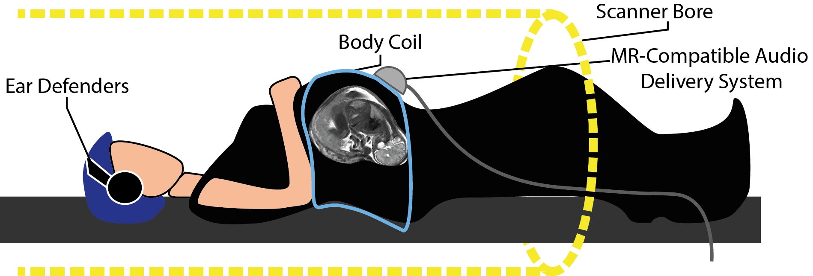

```{=html}
<style>
  .nav-pills>li>a:hover, .nav-pills>li>a:focus, .nav-pills>li.active>a,     .nav-pills>li.active>a:hover, .nav-pills>li.active>a:focus{
     background-color: CadetBlue; 
     }
</style>
```
<!-- https://www.angularfix.com/2021/10/how-to-change-tabset-colors-without.html -->

```{r setup, include=FALSE}
    knitr::opts_chunk$set(message=FALSE,warning=FALSE, cache=TRUE)
```

#  {.tabset .tabset-fade .tabset-pills}

## Audio-Motor Integration

Last compiled: `r Sys.Date()`

**Exploring audio-motor integration: a novel approach to overcoming hearing impairment**

Human speech perception is robust in the face of adverse listening conditions, such as reverberation and background noise. Hearing loss imposes perceptual difficulty in speech perception by degrading incoming speech signals. It is an increasingly common disability and has large societal costs. Recent neuroimaging work has suggested that one mechanism of restoration of a degraded speech signal is couched in articulatory-motor representations. This project seeks to investigate, using multiple different methods, the neural substrates of degraded speech perception, and specifically the role of articulatory-motor representations. In addition to enhancing our understanding of the neurobiology of language, this can be applied to the development of novel training methods to enable hearing-impaired individuals to enhance and exploit articulatory-auditory links to improve their speech comprehension abilities.

**Publications**

Houweling, T., Becker, R., & Hervais-Adelman, A. (2020). The noise-resilient brain: Resting-state oscillatory activity predicts words-in-noise recognition. Brain Lang, 202, 104727. [doi:10.1016/j.bandl.2019.104727](https://www.sciencedirect.com/science/article/pii/S0093934X19303438)

Becker, R., & Hervais-Adelman, A. (2020). Resolving the Connectome, Spectrally-Specific Functional Connectivity Networks and Their Distinct Contributions to Behavior. eNeuro, 7(5), ENEURO.0101-0120.2020. [doi:10.1523/eneuro.0101-20.2020>](https://www.eneuro.org/content/7/5/ENEURO.0101-20.2020)

## In Utero Vocal Learning

Last compiled: `r Sys.Date()`

Human Infants are born crying with an accent that reflects the pitch accent of the language of the environment in which they gestate.

This strand of research concerns itself with this from two perspectives:

1.  How does a fetus learn to implement an accent, despite having no opportunity to practice vocalisation *in utero*?
2.  Is there a benefit to a newborn of crying with a "native" accent?

In order to address these questions we are undertaking an SNF-funded investigation to examine the acoustic features of infants' cries that make them more or less aversive or salient to potential caregivers and the *in utero* cerebral processes that underpin acquisition of early precursors of human speech.



## Speech comprehension

Last compiled: `r Sys.Date()`

Reduced speech comprehension ability is a major consequence of hearing impairments. Specially in acoustically challenging situations, difficulties in speech perception and comprehension can have major consequences for quality of life. The goal of this project is to gain knowledge into the cognitive and brain mechanisms involved in speech-in-noise comprehension. Ultimately, we search for novel insights to guide future aid technologies.

There are two related projects:

1.  Speech-in-noise online (SINON) investigates perception and decision-making processes. The study involves auditory presentation of speech embedded in different types and levels of noise to a healthy population performing different tasks probing speech comprehension. The outputs of the project will directly inform the paradigm design of a subsequent neurofeedback proof-of-concept investigation.

<!-- -->

2.  Speech-in-noise electroencephalography (SINEEG). This project will investigate patterns of electrophysiological activity associated with better speech in noise comprehension. Real-time EEG analysis will be used to trigger stimuli presentation when participants show specific brain-states. Comparing performance in those brain-dependent trials vs independent trials will help defining targets for future neurofeedback-based studies.

#  {.unnumbered}
