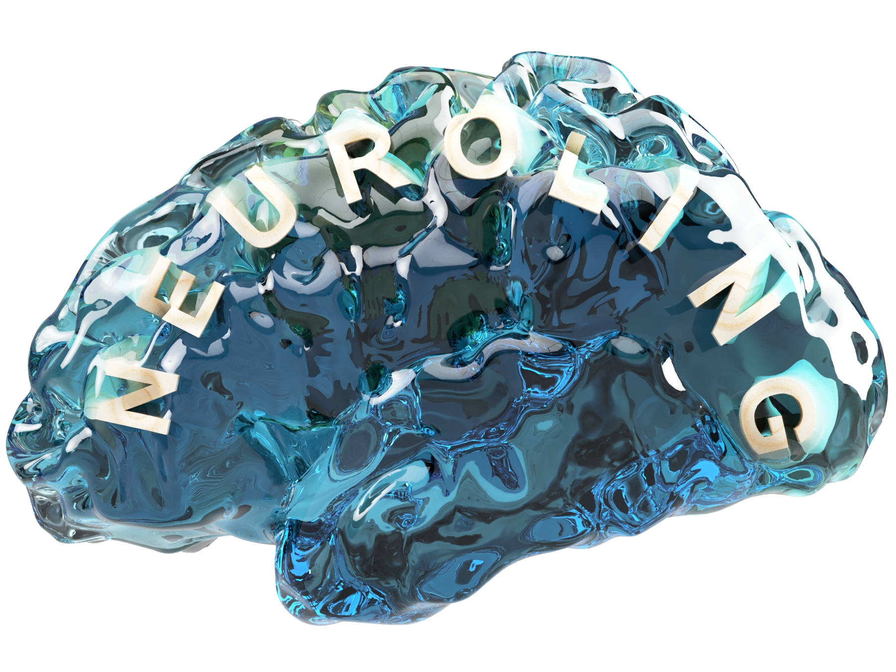

::: floating
```{r out.width='50%', out.extra='style="float:center; padding:10px"',echo=FALSE}

```

This is the website of the Neurolinguistics group at the University of Zurich, and the Dynamics of Brain and Language Lab at the University of Geneva, headed by Prof. Alexis Hervais-Adelman. Have a look at our [ongoing projects](Projects.html), any job and internship [opportunities](Vacancies.html) and [publications](Publications.html).

## About Us

The Dynamics of Brain and Language Lab focuses primarily on the neural basis of language using a variety of methodological approaches to address the broad question of “how is language implemented in the brain?”. As a part of the [NCCR Evolving Language](https://evolvinglanguage.ch/), an evolutionary perspective informs the way we consider the human language system as an exceptional configuration of cognitive abilities that intersect with those of extant non-human species and our common ancestors. We employ MRI, M/EEG, non-invasive electrical brain stimulation, and neurofeedback to look at how the brain processes speech and text. We examine the mechanisms that allow us to [comprehend speech in noise or other acoustically challenging speech](Projects.html#audio-motor-integration). One of the key questions we are interested in is the [role of the motor system in speech perception](Projects.html#audio-motor-integration) and how we might be able to leverage this system to improve speech comprehension for individuals with hearing impairments. We explore pre-natal language development and [how our experiences in the womb affect our speech system](Projects.html#in-utero-vocal-learning), a vital piece of the puzzle in how humans evolved spoken language.

## Wiki

Visit the lab [Wiki](<https://github.com/Neuroling/neuroling.github.io/wiki>) with our Lab's documentation

:::
